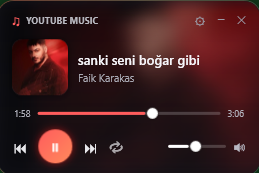
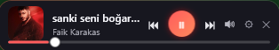
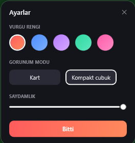

# youtube-music-widget

YouTube Music (ve Windows'ta çalan diğer medya kaynakları) için masaüstünde **her zaman üstte** duran, şık bir oynatıcı widget'ı. Kapak fotoğrafı, şarkı bilgisi ve tam kontrol — kurulum gerektirmez (PowerShell + WPF, Windows'ta yerleşik gelir).

> Bu araç **resmî değildir**, YouTube / Google ile bir ilişkisi yoktur. Windows'un **SMTC** (System Media Transport Controls) arayüzü üzerinden çalışır; tarayıcıdaki YouTube Music sekmesi veya masaüstü uygulamaları (Spotify vb.) ne çalıyorsa onu gösterir/kontrol eder.

<p align="center">
  
</p>
<p align="center">
  <br>
  <sub>Kompakt çubuk — ekranın altına yanaşan ince oynatıcı</sub>
</p>
<p align="center">
  <br>
  <sub>Ayarlar — vurgu rengi, görünüm modu, saydamlık</sub>
</p>

## Özellikler

- 🎵 **Kapak fotoğrafı**, şarkı adı ve sanatçı (otomatik güncellenir)
- ❄️ Kapağın blur'lu hâli **kart arka planına** yansır
- ⏯ Oynat / duraklat, ⏮ önceki, ⏭ sonraki, 🔁 tekrar
- ⏱ **İlerleme çubuğu** — tıklayıp/sürükleyip şarkıda atlama (seek)
- 🔊 **Ses kontrolü** — gerçek sistem sesini okur/yazar (CoreAudio)
- 🎨 **Vurgu rengi** özelleştirme (5 hazır renk) + **saydamlık** ayarı
- 🖥️ İki görünüm: **Kart** ve ekranın altına yanaşan **Kompakt çubuk**
  - Çubukta ses, hoparlör ikonunun üstüne gelince popup olarak açılır
- 📍 Pencere konumu (kart/çubuk için ayrı) ve tüm ayarlar **kaydedilir** — çoklu monitör destekli
- ⚪ Kart modunda **küçültme**: yuvarlak kapak orb'u
- Tek instance, sürüklenebilir, ekran dışına çıkmaz

## Gereksinimler

- **Windows** (PowerShell 5.1+ ve .NET/WPF — yerleşik)
- Bir medya kaynağı (tarayıcıda YouTube Music, Spotify vb.) çalıyor olmalı

## Çalıştırma

`start.vbs` dosyasına **çift tıkla** — konsol açmadan sessizce başlar.

### Windows açılışında otomatik başlatma

```powershell
$s = (New-Object -ComObject WScript.Shell).CreateShortcut("$env:APPDATA\Microsoft\Windows\Start Menu\Programs\Startup\YouTubeMusicWidget.lnk")
$s.TargetPath = "$env:USERPROFILE\youtube-music-widget\start.vbs"
$s.Save()
```

## Ayarlar

⚙ düğmesi → vurgu rengi, görünüm modu (Kart / Kompakt çubuk) ve saydamlık. Seçimler `settings.json`'a kaydedilir (bu dosya repoya dahil değildir).

## Lisans

[MIT](LICENSE)
