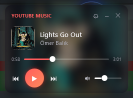

# YTMusicWidget (WPF)

Windows için **her zaman üstte, çerçevesiz** bir müzik widget'i. Çalan medyayı (YouTube Music, Spotify, tarayıcı vb.) **Windows SMTC** üzerinden okur; oynat/duraklat, ileri/geri, konuma atlama (seek) ve **sistem sesini** kontrol eder.

.NET 8 + WPF ile, **MVVM** mimarisi ve ayrık **servis katmanı** kullanılarak yazılmıştır.

<p align="center">
  <br>
  <sub>Kart — bulanık kapak arka planı, başlık/sanatçı, seek ve ses</sub>
</p>
<p align="center">
  
  &nbsp;&nbsp;
  <br>
  <sub>Ayarlar (vurgu rengi + saydamlık) &nbsp;•&nbsp; Küçültülmüş orb</sub>
</p>

## Özellikler

- 🎵 **Canlı medya** — Windows SMTC ile çalan parça, kapak, ilerleme; oynat/duraklat, ileri/geri, seek
- 🔊 **Sistem sesi** — CoreAudio (IAudioEndpointVolume) ile ses seviyesi + sessize alma
- 🖼️ **Kart görünümü** — kapaktan üretilen **bulanık arka plan**, accent renkli kontroller
- ⚪ **Küçültme** — yuvarlak orb; tıklayınca karta döner, sürükleyerek taşınır
- ⚙️ **Ayarlar** — 5 vurgu rengi, saydamlık
- 📍 **Kalıcı durum** — pencere konumu, renk ve saydamlık `%APPDATA%\YTMusicWidget\settings.json`'a kaydedilir; çoklu monitör desteği
- 🪟 Çerçevesiz, saydam, hep üstte, görev çubuğunda görünmez; **tek instance**

## Mimari

```
YTMusicWidget/
├─ Models/
│  └─ AppSettings.cs            # kalıcı ayar modeli
├─ Services/
│  ├─ SettingsService.cs        # System.Text.Json ile %APPDATA% okuma/yazma
│  ├─ AudioService.cs           # CoreAudio COM (IMMDevice / IAudioEndpointVolume)
│  └─ MediaService.cs           # SMTC / WinRT (medya bilgisi, kontroller, kapak)
├─ ViewModels/
│  ├─ ObservableObject.cs       # INotifyPropertyChanged tabanı
│  ├─ RelayCommand.cs           # ICommand
│  ├─ ColorUtil.cs              # hex → WPF Brush
│  └─ PlayerViewModel.cs        # poll döngüsü, komutlar, accent, ses, konum
├─ Views/
│  └─ MainWindow.xaml(.cs)      # Kart / Ayarlar / Orb görünümleri + sürükleme
├─ App.xaml(.cs)                # composition root + tek instance
└─ app.manifest                 # PerMonitorV2 DPI
```

**Öne çıkan teknik noktalar**
- WPF'de elle bildirilmiş **COM arabirimleriyle** (`[ComImport]`) CoreAudio erişimi
- **WinRT** projeksiyonları (`net8.0-windows10.0.19041.0`) ile SMTC
- Dış bağımlılık yok; MVVM altyapısı (ObservableObject/RelayCommand) elle yazıldı
- Servis → ViewModel → View ayrımı, `DispatcherTimer` ile 1 sn'lik yoklama

## Çalıştırma

Gerekli: **.NET 8 SDK** (Windows).

```bash
dotnet run                 # gelistirme
dotnet build -c Release    # derleme
```

> Bu proje, aynı widget'ın PowerShell prototipinin C# / WPF'e taşınmış sürümüdür.

## Lisans

[MIT](LICENSE) © Emre Yılmaz
